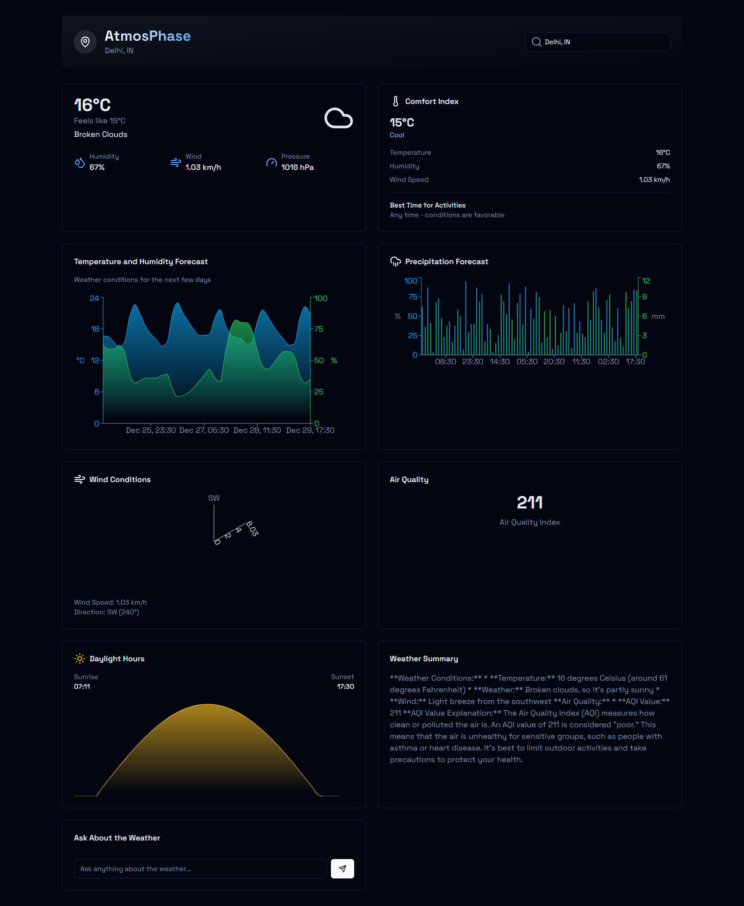

<div align="center">

# ⚡ AtmosPhase ⚡

> *Weather Intelligence Reimagined*

[](https://nextjs.org/)
[](https://recharts.org/)
[](https://openweathermap.org/)
[](https://deepmind.google/technologies/gemini/)

[Demo](your-demo-link) · [Documentation](your-docs-link) · [Report Bug](your-issues-link) · [Request Feature](your-feature-request-link)



</div>

## 🌟 Experience Weather Like Never Before

AtmosPhase isn't just another weather app - it's your personal weather command center, powered by cutting-edge technology and AI.

### 🎯 Key Features

```javascript
const features = {
  dataVisualization: "Interactive Recharts Graphs",
  aiPowered: "Gemini AI Weather Analysis",
  airQuality: "Real-time AQI Monitoring",
  chat: "AI Weather Assistant",
  interface: "Dark Mode & Responsive"
}
```

### 🚀 Quick Setup

```bash
# Clone the future of weather apps
git clone https://github.com/Saoud30/AtmosPhase.git

# Install the magic
npm install

# Set up your superpowers
cp .env.example .env.local
# Add your API keys 🔑

# Launch! 🚀
npm run dev
```

### 🎮 Interactive Features

| Feature | Description | Powered By |
|---------|-------------|------------|
| 📊 Smart Charts | Dynamic weather visualizations | Recharts |
| 🤖 AI Chat | Talk about weather naturally | Gemini Flash 2.0 |
| 🌡️ Weather Pulse | Real-time conditions | OpenWeatherMap |
| 💨 Air Shield | Air quality monitoring | AQICN |


### 🛠️ Tech Arsenal

- ⚡ Next.js for lightning performance
- 📊 Recharts for stunning visualizations
- 🤖 Gemini AI for intelligent insights
- 🌐 OpenWeatherMap & AQICN APIs
- 🎨 Custom dark theme

### ⚡ Environment Setup

```env
NEXT_PUBLIC_OPENWEATHERMAP_API_KEY=your_openweather_key
NEXT_PUBLIC_AQICN_TOKEN=your_aqicn_api_key
NEXT_PUBLIC_GEMINI_API_KEY=your_gemini-studio_key
```

### 🎯 Coming Soon

- [ ] Voice Commands
- [ ] Weather Alerts
- [ ] Custom Themes
- [ ] Location Sharing
- [ ] Historical Analysis

### 🤝 Join the Weather Revolution

```bash
# Start Contributing
git checkout -b feature/AmazingFeature
git commit -m '⚡ Add AmazingFeature'
git push origin feature/AmazingFeature
```

<div align="center">

### 🌟 Star us on GitHub

[](https://github.com/Saoud30/atmosphase/stargazers)

---

Made with ⚡ by [Shazy](https://github.com/Saoud30/AtmosPhase.git)

</div>